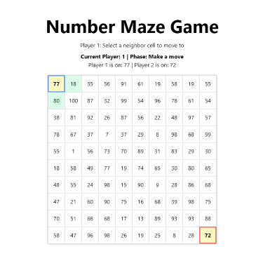

# Numbers Maze Game

A strategic two-player board game where players navigate a maze of numbers, trying to reach the opposite corner while responding to their opponent's moves.



## Overview

Numbers Maze is a turn-based strategy game where players must understand number relationships and plan multiple moves ahead. The game combines elements of path-finding with the challenge of adapting to your opponent's movement patterns.

## Game Rules

1. **Setup**:
   - The game is played on a 10×10 grid filled with random numbers (1-100)
   - Player 1 (blue) starts at the top-left corner
   - Player 2 (red) starts at the bottom-right corner

2. **Objective**:
   - Player 1 aims to reach the bottom-right corner
   - Player 2 aims to reach the top-left corner
   - First player to reach their target corner wins

3. **Gameplay**:
   - On your turn, you can move to any adjacent cell (up, down, left, right)
   - After your move, your opponent must move to a cell that matches the comparison implied by your move
   - If you moved to a higher number, they must move to a higher number
   - If you moved to a lower number, they must move to a lower number
   - If you moved to the same number, they must move to the same number

4. **Special Rules**:
   - If a player has no valid response moves, they lose their entire turn
   - The turn returns to the player who made the original move
   - Players can occupy the same cell

## Technical Implementation

This project is built with:
- React
- TypeScript
- Tailwind CSS for styling

### Key Features

- **Dynamic Game Board**: Randomly generated number board for varied gameplay
- **Intuitive UI**: Visual highlighting of valid moves and player positions
- **Automatic Turn Management**: Detects when a player has no valid moves and handles it automatically
- **Win Detection**: Immediately recognizes when a player reaches their goal

## Installation

1. Clone the repository:
   ```
   git clone https://github.com/yourusername/numbers-maze-game.git
   cd numbers-maze-game
   ```

2. Install dependencies:
   ```
   npm install
   ```

3. Start the development server:
   ```
   npm run dev
   ```

4. Build for production:
   ```
   npm run build
   ```

## How to Play

1. **Starting the Game**: 
   - The game begins with Player 1's turn
   - Valid moves are highlighted in green

2. **Making a Move**:
   - Click on any adjacent cell to move there
   - The game will automatically detect what comparison (>, =, <) your move represents

3. **Responding to a Move**:
   - The responding player must move in accordance with the comparison
   - Only valid response moves will be highlighted

4. **Winning**:
   - Reach the opposite corner before your opponent to win
   - The game will announce the winner and offer a replay option

## Development

### Project Structure

```
src/
├── App.tsx        # Main game component
├── index.tsx      # Entry point
└── assets/        # Static assets
```

### Future Enhancements

- Add AI opponent option
- Implement difficulty levels with different board sizes
- Add game statistics tracking
- Create tournament mode for multiple games

## License

This project is licensed under the MIT License.

## Acknowledgements

- Ideation by Alireza Nasseh
- Special thanks to ClaudeAI for game design and implementation